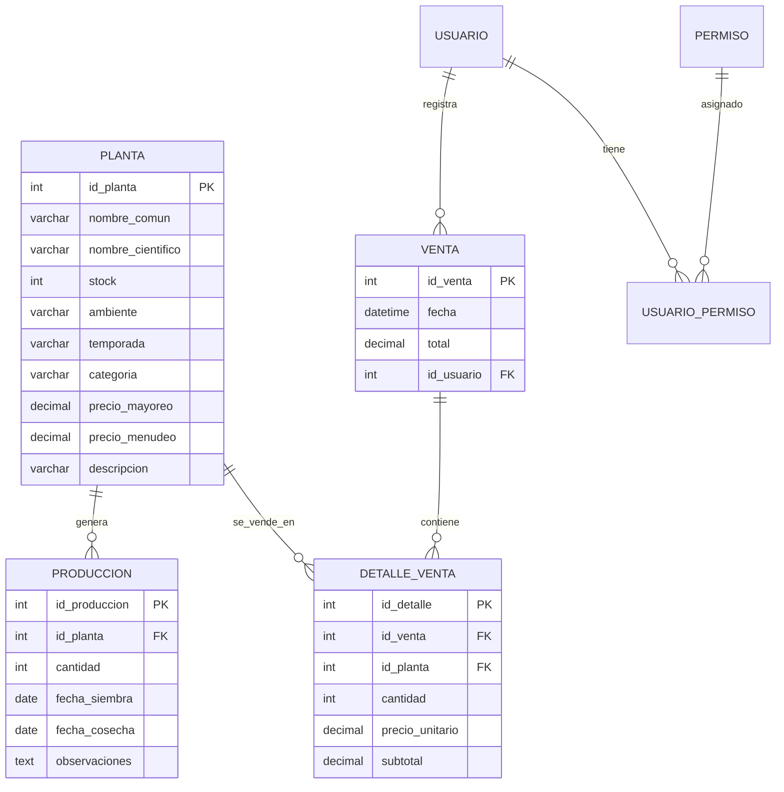

# Modelo conceptual y logico - Stock Bloom

## Descripcion general

Stock Bloom es un sistema para administrar un invernadero. Permite controlar catalogo de plantas, produccion interna, inventario, ventas, usuarios, permisos y reportes.

## Entidades principales

### planta

Representa cada especie o producto vendido/producido por el invernadero.

Atributos principales:

- `id_planta`: identificador unico.
- `nombre_comun`: nombre comercial.
- `nombre_cientifico`: nombre botanico.
- `stock`: unidades disponibles.
- `ambiente`: tipo de exposicion o ambiente recomendado.
- `temporada`: temporada de venta o produccion.
- `categoria`: clasificacion comercial.
- `precio_mayoreo`: precio para venta mayorista.
- `precio_menudeo`: precio para venta minorista.
- `descripcion`: cuidados o notas.

### produccion

Registra lotes de cultivo asociados a una planta.

Relacion:

- Una planta puede tener muchos registros de produccion.
- Cada produccion pertenece a una sola planta.

### venta

Registra una operacion de venta.

Relacion:

- Una venta pertenece a un usuario/cajero.
- Una venta puede tener muchos detalles de venta.

### detalle_venta

Registra los productos vendidos en una venta.

Relacion:

- Cada detalle pertenece a una venta.
- Cada detalle referencia una planta.

### usuario

Representa al personal que accede al sistema.

### permiso

Define acciones autorizadas dentro del sistema, como registrar ventas, ver inventario o administrar usuarios.

### usuario_permiso

Tabla intermedia que relaciona usuarios con permisos.

## Reglas de negocio

- No se deben registrar ventas con cantidad menor o igual a cero.
- No se deben vender plantas inexistentes.
- El stock no debe quedar negativo.
- Los precios deben ser mayores o iguales a cero.
- Cada usuario debe tener solo los permisos necesarios para su funcion.
- Las operaciones criticas deben ejecutarse con transacciones.
- Las ventas deben poder consultarse por dia, mes y anio.

## Normalizacion

El modelo separa catalogo, ventas, detalle de ventas, usuarios y permisos para evitar duplicidad y conservar integridad referencial.

Cumplimiento:

- 1FN: atributos atomicos en cada tabla.
- 2FN: los atributos dependen de la llave primaria completa.
- 3FN: se separan permisos, usuarios, ventas y detalles para evitar dependencias transitivas.

## Relaciones logicas

